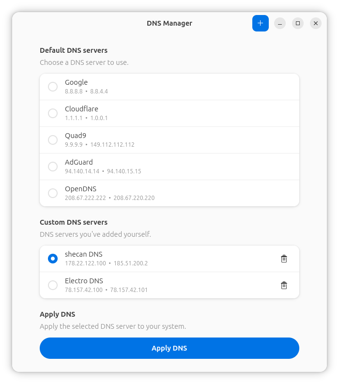
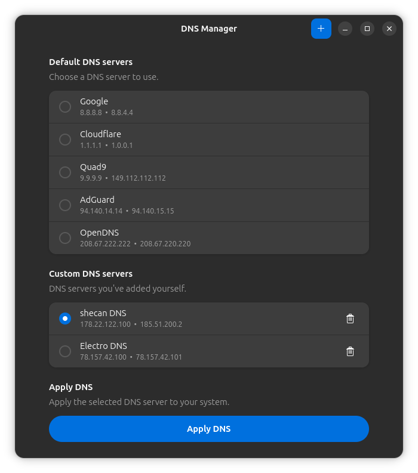

# DNS Manager

A simple and native DNS manager for Linux, built with **Python, GTK4, and Libadwaita**.

The goal of this project is to make changing DNS servers easier through a clean and native GNOME interface.

### Features

- Built-in DNS providers
- Custom DNS servers
- Apply DNS from the UI
- Persistent DNS configuration
- `systemd-resolved` support
- Native GNOME interface

### Preview

#### Light



#### Dark



### Requirements

- Linux
- Python 3
- GTK4 + Libadwaita
- PyGObject
- `systemd-resolved`
- Polkit (`pkexec`)

### Run

```bash
/usr/bin/python3 main.py
```

> 🚧 This project is currently under development.
